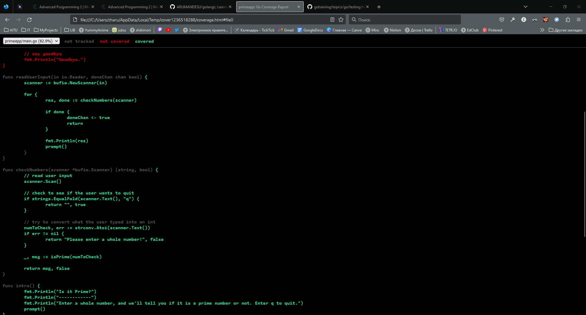

### [Ardanlabs tests golang examples](https://github.com/ardanlabs/gotraining/tree/master/topics/go/testing/tests)

```go
const succeed = "\u2713"
const failed = "\u2717" 
```
failed = ✗ \
succeed = ✓ 


### To see coverage of your tests :
```
go test -coverprofile cover.out &&
go tool cover -html=cover.out
```
